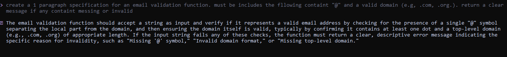

# Part A — Theory (Short Questions)

## Nine Pillars Understanding  
1. **Why is using AI Development Agents (like Gemini CLI) for repetitive setup tasks
better for your growth as a system architect?**

 When we use AI Development Agents like Gemini CLI or other tools, we get free from repetitive tasks such as project setup, folder structure, configs, and boilerplate code. These tasks waste our time and pull   us away from important architecture level thinking.

 2. **Explain how the Nine Pillars of AIDD help a developer grow into an M-Shaped Developer**

**Clarity Skills**  
We learn how to define problems clearly so AI can understand them easily.

**Architecture Design & System Thinking**  
We learn to see the system from above — its components, flows, and boundaries.

**AI-Assisted Coding**  
 We use AI as a coding partner to generate complex features. We give AI clear specifications, and it works based on those instructions.

**Rule-Based Thinking**  
 We learn how to apply rules, limits, and standards inside a system.

**System Mastery**  
We control the entire AI workflow. In this way, we work like a system architect and an AI orchestrator at the same time.

## Vibe Coding vs Specification-Driven Development

1. **Why does Vibe Coding usually create problems after one week?**
   
 Vibe Coding creates problems because the developers create projects, without any structured plan. the project usually After a week becomes crash, which maintain hard, and difficult to scale.

3. **How would Specification-Driven Development prevent those problems?**  
Specification-Driven Development prevents problems by creating a clear blueprint before writing any code. AI and the developer follow the same structured plan, which keeps the system consistent, scalable, and easy to maintain.

5. ## Architecture Thinking   
**How does architecture-first thinking change the role of a developer in AIDD?**

In AIDD (AI-Driven Development), developer transforms from a code typist into a system designer and orchestrator. developer provive clear specification and focuses on defining how the system behaves, how components interact, and how AI agents should collaborate to build the product.

**Explain why developers must think in layers and systems instead of raw code.**  

Developers need to think in layers and systems because modern software is very big and connected. If you only think line by line, everything becomes confusing. Thinking in layers makes the project clear, simple to manage, easy to grow, and it also helps AI understand how your whole project is organized.

# Part B — Practical Task (Screenshot Required)

# Part C — Multiple Choice Questions

1. **What is the main purpose of Spec-Driven Development?**  
A. Make coding faster  
B. **Clear requirements before coding begins**  
C. Remove developers  
D. Avoid documentation  

2. **What is the biggest mindset shift in AI-Driven Development?**  
A. Writing more code manually  
B. **Thinking in systems and clear instructions**  
C. Memorizing more syntax  
D. Working without any tools  

3. **Biggest failure of Vibe Coding?**  
A. AI stops responding  
B. **Architecture becomes hard to extend**  
C. Code runs slow  
D. Fewer comments written  

4. **Main advantage of using AI CLI agents (like Gemini CLI)?**  
A. They replace the developer completely  
B. **Handle repetitive tasks so dev focuses on design & problem-solving**  
C. Make coding faster but less reliable  
D. Make coding optional  

5. **What defines an M-Shaped Developer?**  
A. Knows little about everything  
B. Deep in only one field  
C. **Deep skills in multiple related domains**  
D. Works without AI tools

